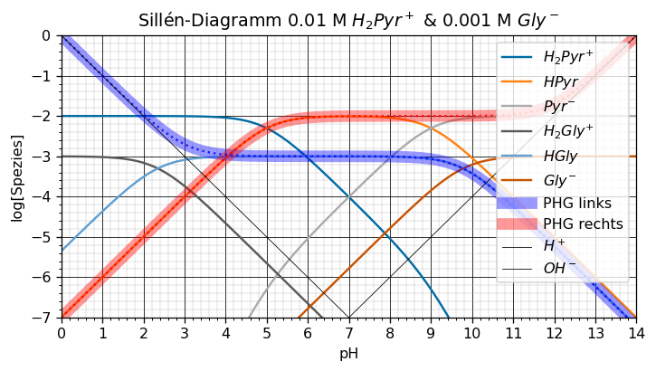

[](https://mybinder.org/v2/gh/janjoch/sillen/HEAD?labpath=use_sillen.ipynb) [](https://nbviewer.org/github/janjoch/sillen/blob/main/use_sillen.ipynb)


# Sillén
1. `acid.py`: A Python module that defines the `Acid` class for modeling equlibirum behaviour of polyprotic acids.

2. `sillen_diagram.py`: A Python script that uses the `Acid` class to generate Sillén diagrams for acids with n dissociable protons based on their pKa values and initial concentrations.

3. `use_sillen.ipynb`: Open this in a Jupyter environment or on [MyBinder](https://mybinder.org/v2/gh/janjoch/sillen/HEAD?labpath=use_sillen.ipynb) to start plotting immediately.

## Getting Started

### Prerequisites

Make sure you have Python installed on your system.

You can install the dependencies using pip:

```bash
pip install -r requirements.txt
```


